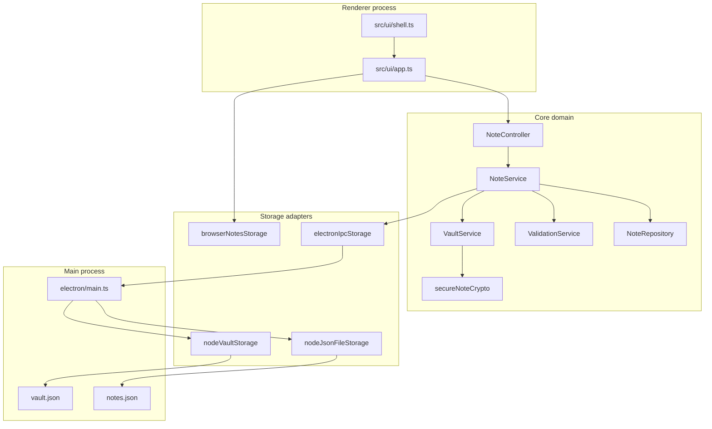

# Architecture Overview

## Technology stack

| Layer | Technology |
|-------|------------|
| Desktop shell | Electron 34 |
| UI / renderer | TypeScript, Vite 6, vanilla DOM |
| Domain logic | TypeScript (`src/core/`) |
| Persistence | JSON snapshot via Node file IO (desktop) or localStorage (web dev) |
| Unit tests | Vitest |
| Reference Python module | `python/astranotes/` (parallel domain sketch) |

## Layered structure



## Key design decisions

1. **Thin controller** — `NoteController` exposes UI-facing commands; business rules live in `NoteService`.
2. **Adapter pattern** — `FileStorageManager` and vault storage use injected read/write functions for Electron, browser, or test mocks.
3. **Safe save** — Build next snapshot → persist → apply to repository only on success (NFR-5).
4. **Secure notes** — Optional `isSecure` flag; content encrypted with PBKDF2 + AES-GCM; vault metadata in `vault.json` (salt + verifier only; password never stored).
5. **Atomic writes** — Desktop `notes.json` uses temp file + rename to reduce partial-write corruption.

## Source layout

```
electron/           Main process, IPC, application menu
src/core/           Note, repository, service, validation, vault, crypto
src/adapters/       File, IPC, browser, vault adapters
src/ui/             Shell UI, app bootstrap
src/styles/         Global and shell CSS
test/               Vitest unit tests
python/             Reference Python domain module
docs/               Requirements, planning, traceability, deployment
```

## UML artifacts

Formal UML diagrams (class, object, use case, activity, deployment) are in:

[`../artifacts/uml/UML diagrams .docx`](../artifacts/uml/UML%20diagrams%20.docx)

Written rationale from that document: use cases show user options; activity diagrams show flow including errors and saves; class diagram shows component structure; object diagram shows runtime data; deployment diagram shows local file storage.
